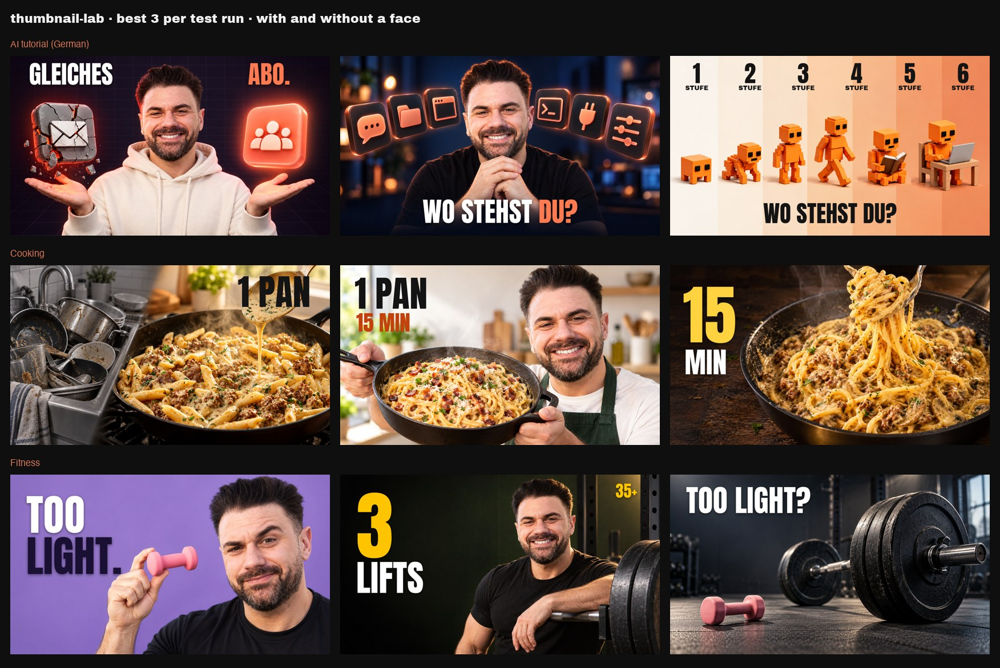

# thumbnail-lab

A Claude Code skill that makes YouTube thumbnails the way top creators do, and shows its work.



What it does, in one run:

1. **References.** You give 3 to 5 thumbnails you like, or it searches your topic. For each one it computes the outlier factor (views divided by the channel's median in the same period) and checks what carried it: the thumbnail, or the title plus a trending topic.
2. **Teardown.** Each reference becomes a style JSON: layout, person, object, background, text, camera, light, palette, mood. Style only, never the creator's identity.
3. **Packages.** Title, thumbnail message and first hook sentence written as one promise.
4. **Render.** Images without text, with your face (from your photos) or faceless, through the image tool you already have: OpenAI, Google Gemini (Nano Banana) or the Codex CLI.
5. **Headline in code.** A real font (Anton, bundled), exact spelling, checked for contrast and size, bottom-right corner left free for YouTube's video length.
6. **Review.** Phone-size previews, a mock feed between your references, a strict rubric, the weakest redone.
7. **Hand-over.** The best three as a contact sheet, a parameter table to reproduce every image, and a YouTube Test & Compare plan.

## Install in 3 steps

1. Install [uv](https://docs.astral.sh/uv/) if you don't have it: `curl -LsSf https://astral.sh/uv/install.sh | sh` (macOS/Linux) or `brew install uv`. It installs the Python parts (yt-dlp, Pillow) by itself.
2. Copy the `thumbnail-lab` folder into `~/.claude/skills/`.
3. Give it an image tool, any one of: `export OPENAI_API_KEY=...` or `export GEMINI_API_KEY=...` in your shell profile, or a logged-in [Codex CLI](https://developers.openai.com/codex/cli) (`codex login`) on a ChatGPT plan.

Then, in Claude Code: `/thumbnail-lab My video title`. The skill checks everything first and tells you what is missing.

Nothing else is needed: no ffmpeg, no browser automation, no YouTube API key.

## Costs per run

A run renders about 8 images (6 concepts plus 2 redos). Prices as of October 2026, check your provider:

| Backend | Default model | Per image | Per run |
|---|---|---|---|
| OpenAI | `gpt-image-2.5-sunburst`, 1536x864, high | about $0.04 plus a few cents for input images | about $0.40 |
| Google Gemini | `gemini-3-pro-image`, 16:9, 2K | about $0.13 | about $1.10 |
| Codex CLI | `image_gen` | included in a ChatGPT plan, counts against its usage limits | $0 extra |

Change the model with `THUMBNAIL_LAB_OPENAI_MODEL` or `THUMBNAIL_LAB_GEMINI_MODEL`. YouTube research uses yt-dlp and costs nothing.

Your prompt reaches the image model word for word. OpenAI and Gemini get it directly. Codex passes it through its agent to its image tool, so the skill compares what the image tool received against what it sent and warns if anything was rewritten. The prompt is JSON by default; `--prompt-format prose` sends the same fields as labelled paragraphs. Codex renders give up after 600 seconds (`THUMBNAIL_LAB_CODEX_TIMEOUT`).

## The teardown prompt

Works on its own too. Paste it with a thumbnail you like into any vision model:

```
Describe this thumbnail as a complete JSON style spec so an image model can
recreate the style for a different topic. Fields: layout (grid, zones for
person, object and text, empty areas), person (pose, expression, gaze,
position, share of frame height, crop, clothing), object (what, material,
finish, lighting, shadow, size), background (type, color, depth), text
(word count, font style, weight, case, color, outline, position, size),
camera (lens, angle, focus), lighting (key, fill, rim, color temperature),
palette (base, accent), mood. Describe style only, not the creator's identity
or brand.
```

Then: "Apply this style JSON to my video about [topic]. Keep layout, light and materials. Replace the object with [your idea]. Leave the text zone empty."

## What the tests taught it

Built from 78 thumbnail drafts for one video plus test runs in three niches (AI tutorials, cooking, fitness), with and without a face:

- **Copy the structure of a winner, not its words.** Prompt as JSON or as prose made no visible difference. Tearing a proven thumbnail down into a style spec and applying it to new content did: 3 of 4 drafts looked clearly more professional.
- **Never let the image model write the headline.** Set in code it was exact 12 of 12 times.
- **Check what carried an outlier.** In the cooking test one channel used the identical food close-up on every video and landed anywhere between 0.2x and 456x: the title carried, not the image. In a sample of 11 faceless AI outliers, 6 rode a trending topic.
- **Judge at feed size.** Many drafts that look good full-size fall apart at 168 px.

## Where it lives

Each run writes to `./thumbnail-lab/<title>-<YYYYMMDD-HHMM>/`: references, style JSONs, concepts, renders (with the exact prompt next to each), `finals/` with the headlines set, review sheets and `final/` with the contact sheet and `params.md`. Nothing is uploaded anywhere.

Run the scripts by hand if you like: `uv run ~/.claude/skills/thumbnail-lab/scripts/lab.py --help`.

## Limits

- The outlier factor is approximate: YouTube rounds view counts in channel lists, and very old videos are compared with the channel's oldest uploads that yt-dlp returns.
- The face mode needs good photos: portrait lens, good light, a few expressions. Selfies from a wide-angle lens make faces wider.
- Image models still miss sometimes (hands, counts, a background you did not ask for). The review step catches most of it; you get the final say.

## Licence

Code: MIT (see `LICENSE`). Fonts in `assets/fonts`: SIL Open Font License 1.1 (see the `OFL-*.txt` files).
