# Poppy-Klon: Open-Source-Landschaft

Stand: 26.09.2026. Recherche über GitHub-API, Web-Suche und Projektseiten. Nichts geklont, nichts installiert. Sterne und Aktivität stammen direkt aus der GitHub-API vom 26.09.2026.

## Kurzfazit

Ein fertiges Open-Source-Projekt, das Poppy 1:1 nachbaut und frei nutzbar ist, gibt es nicht. Am nächsten kommen zwei Projekte:

1. **ThoughtDAG** (MIT, sehr aktiv): Canvas auf React Flow, bei dem die Verbindungen den Kontext des nächsten Chats bestimmen. Genau Poppys Kernmechanik. Es fehlen die Quellen-Nodes für YouTube, TikTok, Instagram und Webseiten.
2. **Refly v0.10.0** (letzter Canvas-Release, 27.08.2025): UX am nächsten an Poppy (Web-Links, Dokumente, KI-Antworten als Nodes auf einem Canvas, Multi-Model). Aber toter Zweig, schwerer Stack mit sechs Containern, Sonderlizenz mit Firmen-Einschränkung und einem behaupteten Design-Patent auf das Canvas-Interface. Taugt als UX-Referenz zum Ausprobieren, nicht als Basis.

Empfehlung: eigene App auf **React Flow (MIT)** plus fertige Bausteine (yt-dlp, whisper.cpp, defuddle, Vercel AI SDK). ThoughtDAG dient dabei als Code-Vorlage, die man dank MIT-Lizenz frei ausschlachten darf. Details unten unter "Build-Strategie".

## Referenz: was Poppy ausmacht

Die Checkliste, gegen die alle Kandidaten gemessen werden:

| # | Poppy-Feature | Gewicht |
|---|---|---|
| P1 | Infinite Canvas mit frei platzierbaren Karten, Gruppen, Verbindungen | hoch |
| P2 | Quellen-Nodes: YouTube, TikTok, Instagram (automatisch transkribiert), PDF, Webseite, Bild, Voice Note, Text | hoch |
| P3 | Chat-Node, der alle verbundenen Nodes als Kontext nutzt | hoch |
| P4 | Multi-Model (Claude, GPT, Gemini) pro Chat wählbar | mittel |
| P5 | Board-Dashboard (Liste aller Boards) | mittel |
| P6 | Boards teilen, Vorlagen | niedrig (für Eigennutzung) |

## Vergleichstabelle

Nähe zu Poppy auf einer Skala von 1 (fremd) bis 5 (praktisch Poppy), bewertet gegen P1 bis P6.

| Projekt | Sterne | Letzte Aktivität | Lizenz | Stack | Nähe | Wartung |
|---|---|---|---|---|---|---|
| Refly v0.10.0 (Canvas-Ära) | 7.532 | Tag 27.08.2025, Repo zuletzt 29.07.2026 | Apache 2.0 mit Zusatzbedingungen | React Flow 12, NestJS, Prisma, Postgres, Redis, Qdrant, MinIO, SearXNG | 4 | Canvas-Zweig eingestellt |
| ThoughtDAG | 493 | 26.09.2026 | MIT | React 19, Vite, React Flow 12, Vercel AI SDK 7, Electron | 3,5 | sehr aktiv, ein Maintainer |
| tldraw SDK + Starter Kits | 50.583 | 26.09.2026 | tldraw-Lizenz (Hobby gratis mit Wasserzeichen, sonst kostenpflichtig) | React, Cloudflare Worker, AI SDK | 3 (als Baustein) | sehr gesund, Firma dahinter |
| React Flow / xyflow | 38.501 | 24.09.2026 | MIT | React oder Svelte | 2 (als Baustein) | sehr gesund, Firma dahinter |
| open-notebook | 39.523 | 20.09.2026 | MIT | Next.js, FastAPI, SurrealDB, LangChain, content-core | 2 | sehr aktiv, Community |
| AFFiNE (Edgeless + AI) | 72.996 | 26.09.2026 | MIT (Client), EE-Lizenz für Teile des Backends | TypeScript, BlockSuite, Rust, Postgres, Redis | 2,5 | sehr gesund, Firma dahinter |
| Obsidian Canvas + Plugins | 3.705 (JSON Canvas), 424 (Cannoli), 199 (Caret), 62 (Canvas LLM) | uneinheitlich | MIT / GPL-3.0 | Obsidian-Plugins, JSON Canvas | 2,5 | Caret eingestellt, Rest klein |
| NodeTool | 543 | 26.09.2026 | AGPL-3.0 | TypeScript, Electron, Python | 2 | aktiv |
| OpenCove | 1.600 | 25.09.2026 | MIT | Electron, Canvas für Claude Code und Codex | 1,5 | aktiv, Alpha |
| SurfSense | 16.266 | 26.09.2026 | Apache 2.0, Teil unter BSL 1.1 | Python, Next.js, Desktop | 1 | aktiv, aber anderer Fokus |
| Flowise / Langflow | 55.487 / 155.275 | 13.08.2026 / 26.09.2026 | Apache 2.0 mit Enterprise-Teil / MIT | TypeScript / Python | 1 | gesund, falsches Produkt |

Lizenz-Übersetzung für deinen Fall (Eigennutzung, später eventuell für andere):

| Lizenz | Privat nutzen | Ändern | Selbst hosten | Als SaaS für andere |
|---|---|---|---|---|
| MIT / Apache 2.0 | ja | ja | ja | ja |
| AGPL-3.0 (NodeTool) | ja | ja | ja | ja, aber eigener Code muss dann offen gelegt werden |
| GPL-3.0 (Canvas LLM) | ja | ja | ja | ja, bei Verteilung Code offen legen |
| Refly-Lizenz | ja, auch kommerziell als Einzelperson | ja | ja | nur mit kommerzieller Lizenz von Refly |
| tldraw-Lizenz | nur mit Hobby-Lizenz (Antrag, Wasserzeichen) | ja | nur Entwicklung frei | nur mit kostenpflichtiger Lizenz |
| AFFiNE | ja (Community Edition) | Client ja | CE ja | Client-Code ja, Backend-EE-Teile nein |

## Kandidaten im Detail

### 1. Refly, Canvas-Ära (v0.3.0 bis v0.10.0)

https://github.com/refly-ai/refly

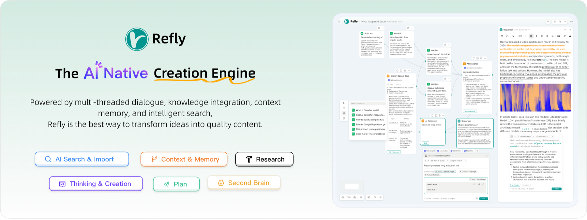
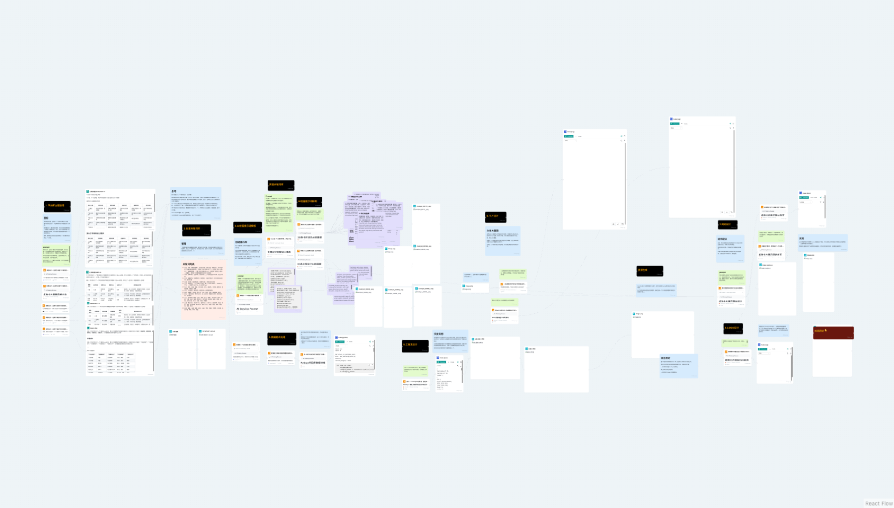

`refly-03.png` zeigt das heutige Cover (Vibe-Workflow-Positionierung), nur zum Vergleich.

**Pivot-Zeitpunkt.** Releases: v0.3.0 (19.02.2025) bis v0.10.0 (27.08.2025) laufen unter "AI Native Creation Engine" bzw. "Agentic Workspace". Danach folgten 2.450 Commits ohne Release, dann v1.1.0 (02.02.2026) mit der Ansage "evolving from a creative engine into the first open-source platform for building agent skills". Der letzte Canvas-Release ist also **v0.10.0**. Docker-Images `reflyai/refly-api:0.10.0` und `reflyai/refly-web:0.10.0` existieren noch auf Docker Hub (geprüft). Der letzte Commit im Repo ist vom 29.07.2026, also zwei Monate Stille.

**Was v0.10.0 kann.** Freier Canvas auf React Flow mit Node-Typen für Weblinks, Dokumente, Ressourcen, KI-Antworten, Code-Artefakte, Bilder. Mehrfachauswahl von Nodes als Kontext für die nächste Frage. 13+ Modelle (Claude, GPT, Gemini, DeepSeek, Azure, Bedrock). Datei-Import (PDF, DOCX, EPUB, HTML, Markdown), Wissensbasis mit RAG (Qdrant), Websuche über SearXNG, Notion-artiger Editor mit Kollaboration (Tiptap, Yjs, Hocuspocus), in v0.10.0 zusätzlich "Resource Hub" und ein Agent-Modus. YouTube-, TikTok- oder Instagram-Transkription ist weder im README noch im aktuellen Code belegt (GitHub-Code-Suche: 0 Treffer für "youtube transcript"). Voice Notes als Quelle ebenfalls nicht belegt.

**Stack.** Monorepo mit `apps/web`, `apps/api` (NestJS 10, Prisma 5, LangChain 0.3, BullMQ) und `packages/ai-workspace-common` (React Flow 12, Tiptap). Middleware: Postgres 16, Redis Stack, Qdrant, MinIO, SearXNG, optional Elasticsearch. Es gab zusätzlich einen Electron-Build mit SQLite.

**Lizenz (in v0.9.1 und heute wortgleich).** Apache 2.0 plus Zusatzbedingungen:

- Einzelpersonen dürfen Refly frei nutzen, "including commercial activities by individuals". Dein YouTube-Kanal als Einzelperson ist damit abgedeckt.
- Firmen und Organisationen brauchen für jede kommerzielle Nutzung eine Lizenz, ausdrücklich auch "Using Refly in a business/organizational environment" und "operating Refly as a service for others". Sobald du über eine GmbH oder UG arbeitest oder das Tool anderen anbietest, brauchst du eine Lizenz.
- Logo und Copyright im Frontend dürfen nicht entfernt werden.
- Mitwirkende stimmen zu, dass Refly die Lizenz jederzeit verschärfen darf.
- Zusatz: "The interactive design of this product, including the free-form canvas interface and AI-powered features, is protected by appearance patent." Code oder Design daraus in ein eigenes Produkt zu übernehmen ist also ein echtes Risiko.

**Brauchbar?** Zum Anschauen ja: Docker-Compose mit den gepinnten 0.10.0-Images hochziehen und eine Woche lang testen, welche Poppy-Features du wirklich nutzt. Als Basis nein: keine Sicherheits-Updates mehr, der Stack ist für einen Solo-Creator überdimensioniert, der Code ist riesig, YouTube fehlt, und die Lizenz verbaut den Weg "später für andere".

### 2. ThoughtDAG

https://github.com/chenxiachan/thoughtdag

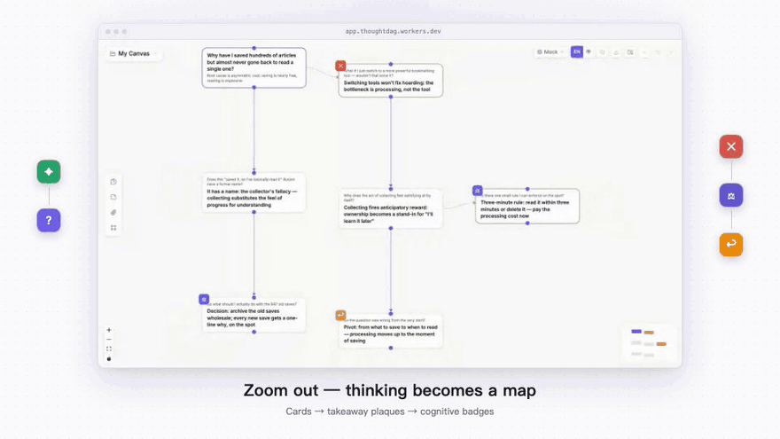
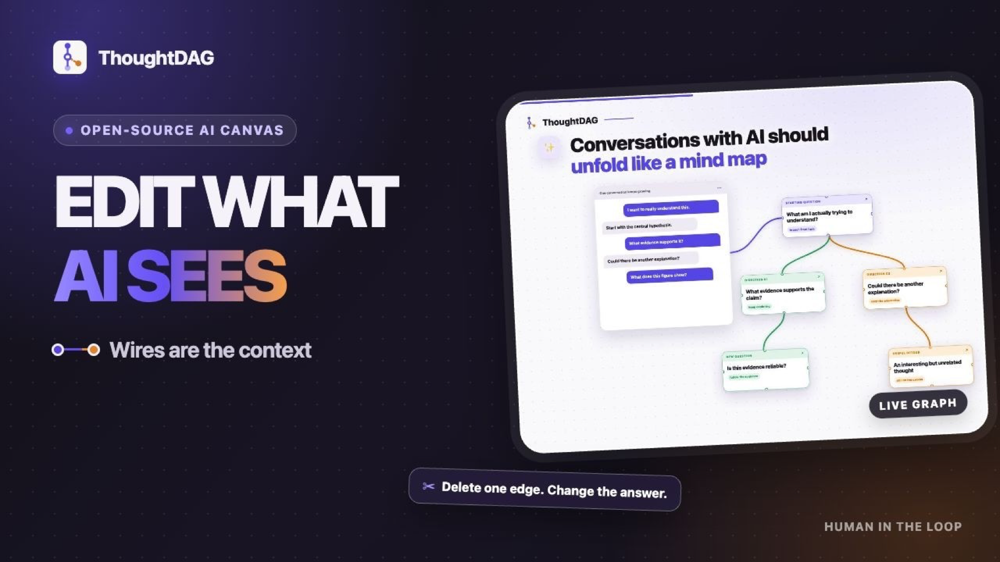

**Idee.** "Wires are the context": Jede Frage ist ein Node, Verbindungen bestimmen, was das Modell beim nächsten Aufruf sieht. Vor dem Senden zeigt eine Vorschau den kompletten Kontext. Das ist Poppys Kernmechanik (P3) in sauberer Form.

**Features.** PDF, Bild und HTML neben dem Canvas lesen, Passagen als eigenen Node ausschneiden (mit Seitenreferenz). Pfade kondensieren, Highlights zu Text "weben", Export als Markdown. Read-only-Sharing eines Graphen (P6). Ordner-Backup als echte JSON-Dateien. "Session Atlas" öffnet lokale Claude-Code- und Codex-Sessions als Graph, dazu CLI (`npx thoughtdag find ...`) und MCP-Server. Modelle über Vercel AI SDK (Anthropic, OpenAI, Google, DeepSeek), Ollama und OpenAI-kompatible Endpoints (damit auch OpenRouter).

**Stack.** React 19, Vite 7, @xyflow/react 12, AI SDK 7, pdfjs, Zustand. Desktop über Electron 43 (auch `brew install --cask thoughtdag`), Web-Demo auf Cloudflare Workers.

**Lücken zu Poppy.** Keine Quellen-Nodes für YouTube, TikTok, Instagram, Webseiten-URL, Voice Notes (P2 fehlt großteils). Nodes sind gesprächszentriert, nicht quellenzentriert. Board-Dashboard nur als Canvas-Umschalter.

**Gesundheit.** Erstellt 17.02.2026, 698 von rund 710 Commits vom Gründer. Sehr hohe Taktung, aber Bus-Faktor 1 und schnell wandernde Architektur (in sieben Monaten CLI, MCP, DeepSeek-Harness-Plugin, Memory-Layer "Jev"). Ein Fork würde schnell vom Original abdriften.

### 3. tldraw SDK mit Starter Kits

https://github.com/tldraw/tldraw

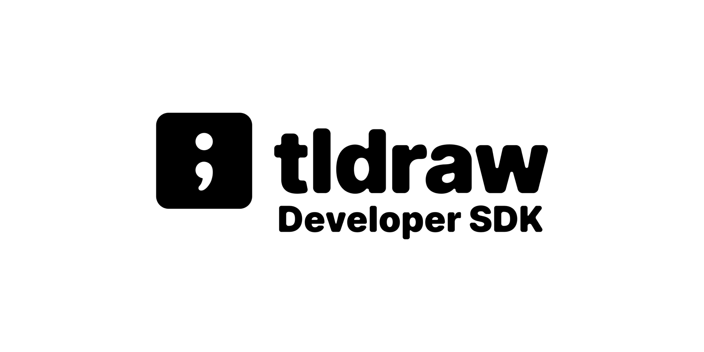
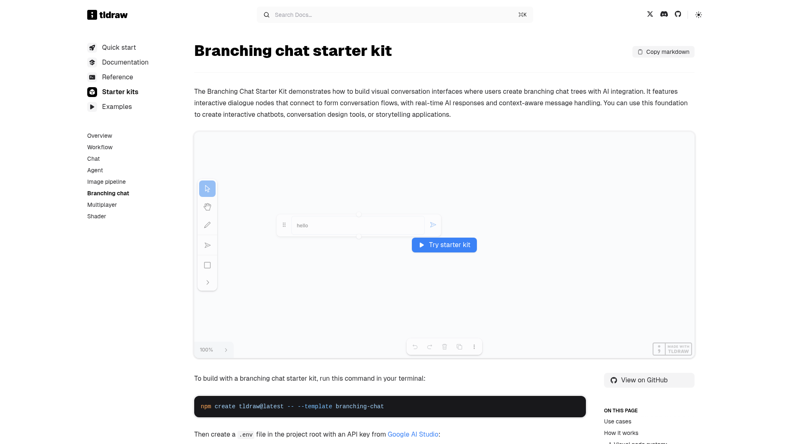

Das beste Whiteboard-Gefühl (Freihand, Sticky Notes, Pfeile, Custom Shapes). Es gibt offizielle Starter Kits, die genau Poppy-Bausteine abdecken: **Branching Chat** (Nodes mit Ports, beim Senden wird rückwärts durch verbundene Nodes der Kontext gesammelt, Streaming über Vercel AI SDK), **Workflow**, **Chat**, **Agent**, **Image Pipeline**. Start mit `npm create tldraw@latest -- --template branching-chat`.

Haken ist die Lizenz: Produktion ohne License Key ist verboten, die Software prüft den Key technisch. Die **Hobby-Lizenz** ist gratis für "personal projects ... ideas that aren't a business yet", auf Antrag, mit "made with tldraw"-Wasserzeichen. Für ein Angebot an andere brauchst du die kommerzielle Lizenz (Preis nicht öffentlich, 100 Tage Trial). Für reine Eigennutzung machbar, für "später für andere" ein Kostenfaktor.

MIT-Alternative mit tldraw-ähnlicher API: quickdraw (https://github.com/quickdrawjs/quickdraw, 491 Sterne, jung). Noch zu unreif für eine Empfehlung.

### 4. React Flow / xyflow

https://github.com/xyflow/xyflow

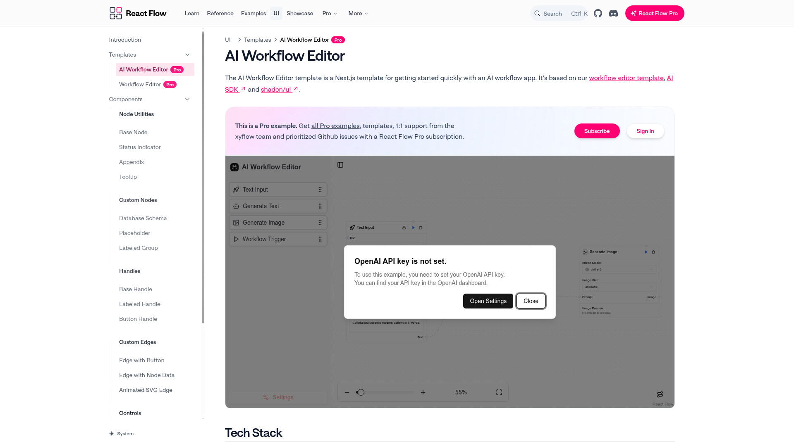

MIT, 38.501 Sterne, von einer kleinen Firma gepflegt, Industriestandard für Node-Editoren. Refly und ThoughtDAG nutzen es beide. Es liefert Canvas, Pan und Zoom, Nodes als normale React-Komponenten, Kanten, Gruppen (Subflows), Minimap. Kein Freihandzeichnen, was Poppy aber kaum braucht.

"React Flow UI" liefert fertige shadcn-Komponenten (Base Node, Handles, Status-Indikator) frei. Das Template "AI Workflow Editor" (Next.js, AI SDK, shadcn, Zustand) ist ein Pro-Beispiel und braucht ein kostenpflichtiges React-Flow-Pro-Abo. Nicht nötig, aber eine gute Abkürzung.

### 5. open-notebook

https://github.com/lfnovo/open-notebook

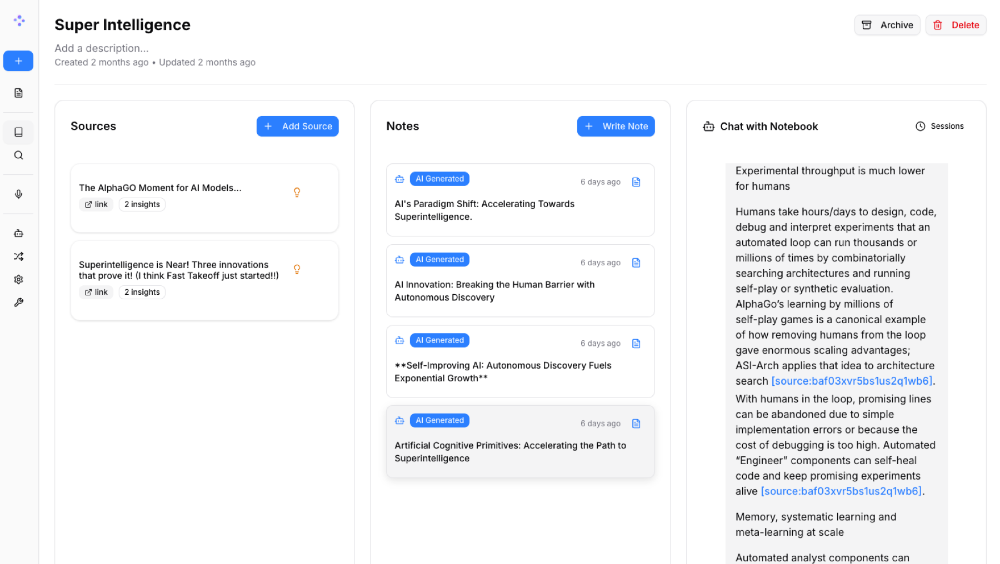

NotebookLM-Klon, MIT, 39.523 Sterne, sehr aktiv. Drei Spalten (Quellen, Notizen, Chat), **kein Canvas**. Stark ist die Quellen-Pipeline: PDFs, Videos, Audio, Webseiten, Office-Dateien, dazu 18+ Provider über die Bibliothek Esperanto und Podcast-Generierung. Next.js-Frontend, FastAPI-Backend mit voller REST-API (Port 5055), SurrealDB.

Nützlich als Baustein: Die Extraktion steckt in der eigenständigen Bibliothek **content-core** (https://github.com/lfnovo/content-core, MIT, 174 Sterne). Sie extrahiert URLs, YouTube, Reddit, PDF, DOCX, PPTX, EPUB, Audio und Video über eine Python-API, eine CLI und einen MCP-Server. Theoretisch könnte eine Canvas-Oberfläche open-notebook sogar komplett als Backend nutzen.

### 6. AFFiNE (Edgeless-Modus mit AI)

https://github.com/toeverything/AFFiNE

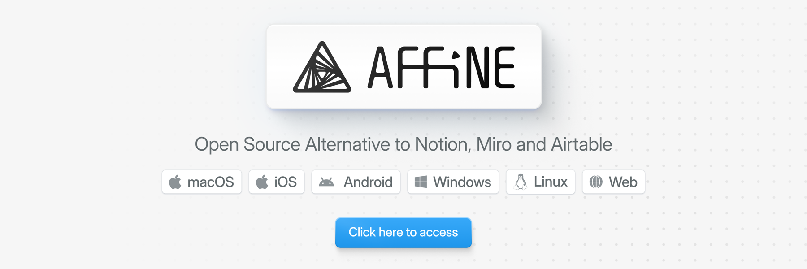
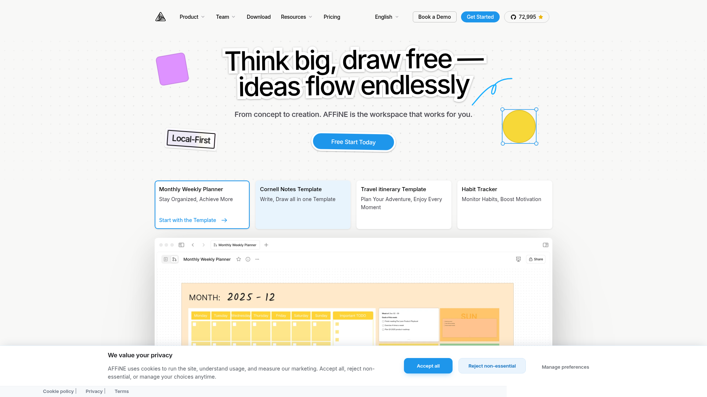

Notion plus Miro, 72.996 Sterne. Der Edgeless-Modus ist ein echtes Whiteboard (Engine BlockSuite, MPL-2.0), YouTube- und Web-Embeds sind möglich. AFFiNE AI läuft selbst gehostet per Bring-Your-Own-Key mit OpenAI, Anthropic, Gemini und FAL. Laut Community-Threads bleibt die Self-Host-AI allerdings fummelig (Aktionen sind an bestimmte Provider gebunden, lange als "experimentell" markiert).

Warum nur 2,5: Die AI arbeitet auf Dokument- oder Auswahl-Ebene, nicht über "verbundene Nodes als Kontext". Automatische Video-Transkription ist nicht belegt (die Marketingseite "YouTube Summarizer" beschreibt Transkript-zu-Notiz, nicht Link-zu-Transkript). Die Codebasis ist riesig (Rust, BlockSuite, CRDT-Sync). Poppy-Logik hineinzubauen wäre teurer als ein Neubau.

### 7. Obsidian Canvas mit Plugins (Claude-Code-nah)

- JSON Canvas (offenes Dateiformat): https://github.com/obsidianmd/jsoncanvas, MIT
- Cannoli: https://github.com/DeabLabs/cannoli, MIT, 424 Sterne, zuletzt 13.11.2025
- Canvas LLM: https://github.com/farlenkov/obsidian-canvas-llm, GPL-3.0, 62 Sterne, zuletzt 16.09.2026
- Caret: https://github.com/jcollingj/caret, MIT, 199 Sterne, laut README nicht mehr gepflegt

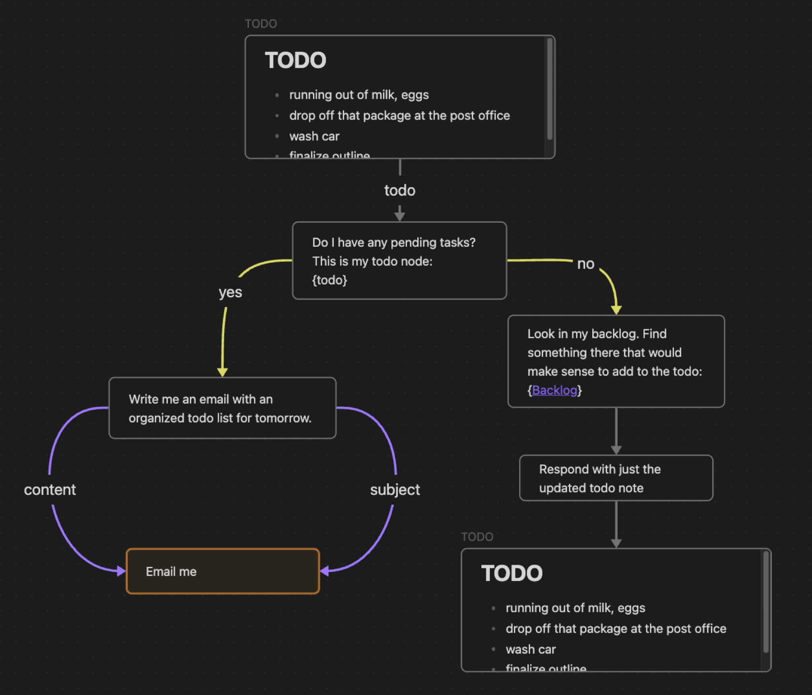
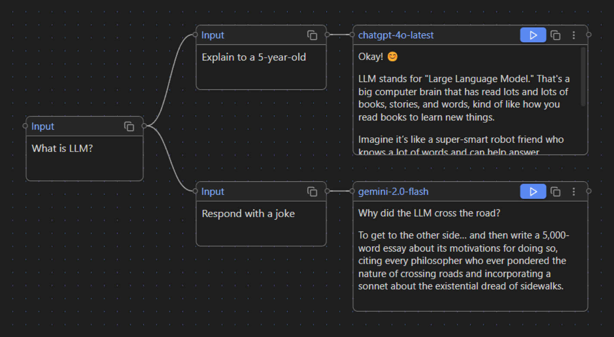

Canvas LLM kommt Poppy innerhalb von Obsidian am nächsten: Input-Karten, File-Input (md, canvas, docx), Web-Input mit eingebettetem Browser, Generate-Node. Cannoli macht aus dem Canvas ein ausführbares LLM-Skript. Vorteil dieses Wegs: Boards sind simple JSON-Dateien im Vault, die Claude Code direkt lesen und schreiben kann. Du arbeitest ohnehin in Obsidian und hast schon Skills für YouTube-Transkripte (`/watch`, `video-transcript-extractor`) und Web-Extraktion (`defuddle`). Nachteil: kein Poppy-Gefühl im Chat-Node, Plugins sind klein und teils verwaist.

### 8. NodeTool

https://github.com/nodetool-ai/nodetool

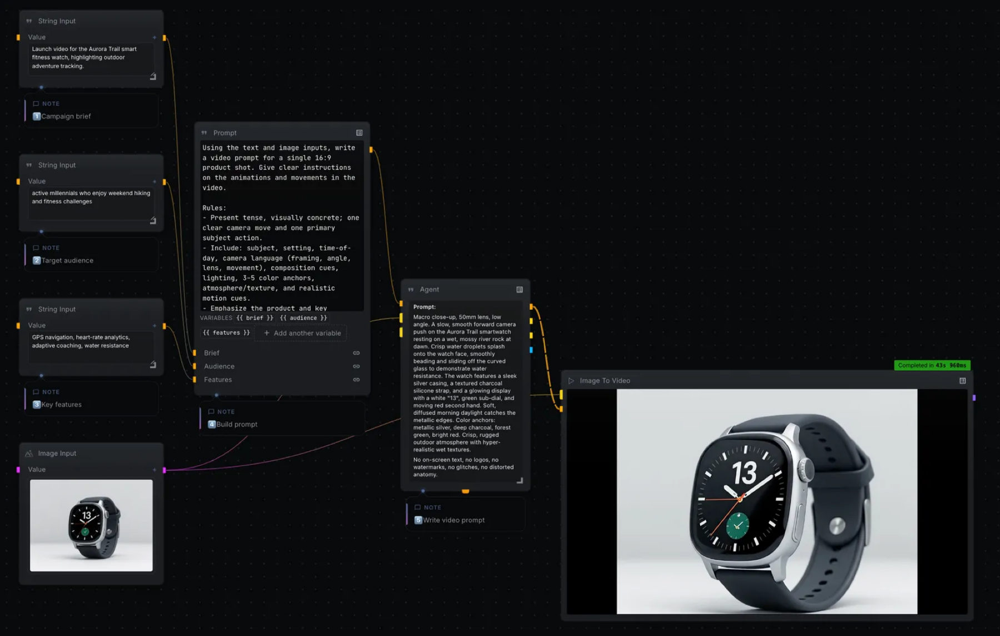

"Agent-first Creative Workspace", AGPL-3.0, Desktop-Studio für macOS. Node-Graphen für Bild, Video, Audio und Text mit eigenen Keys oder lokalen Modellen, MCP-Anbindung. Näher an ComfyUI als an Poppy: Pipelines statt Recherche-Board. AGPL ist für Eigennutzung egal, für ein Produkt lästig.

### 9. OpenCove

https://github.com/DeadWaveWave/opencove

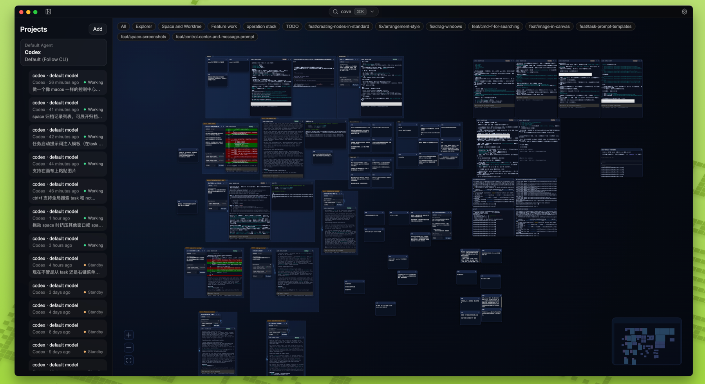

MIT, 1.600 Sterne, Alpha. Infinite Canvas, auf dem Claude-Code- und Codex-Sessions, Terminals, Tasks und Notizen liegen. Kein Poppy, aber das Muster "Claude Code lebt auf einem Canvas" passt zu deinem Setup und ist interessant, falls der Klon später Claude-Code-Sessions als Nodes haben soll.

### 10. Off-Target, kurz geprüft

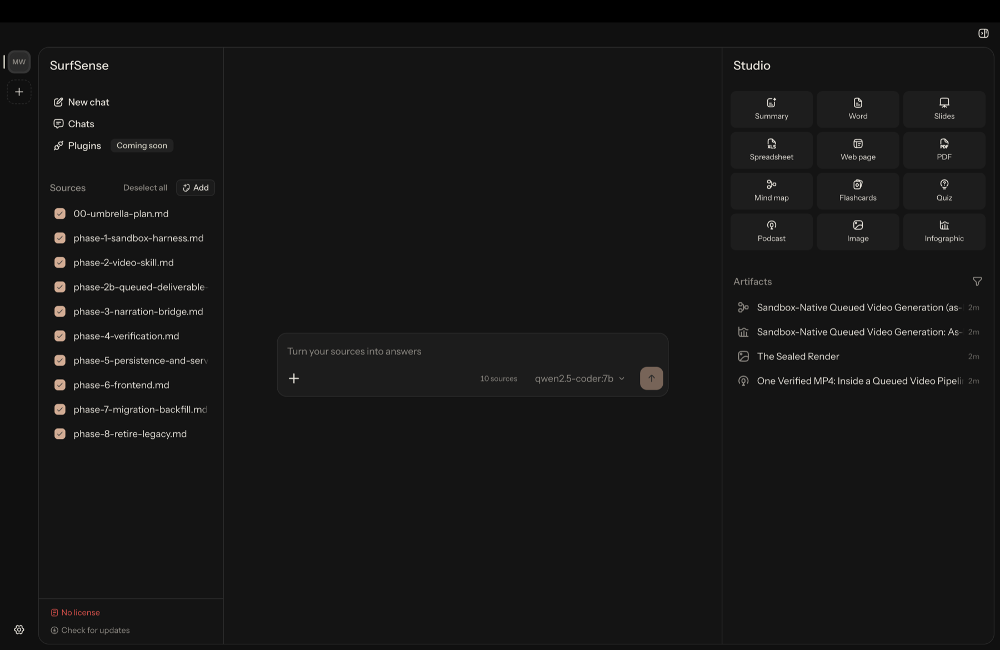
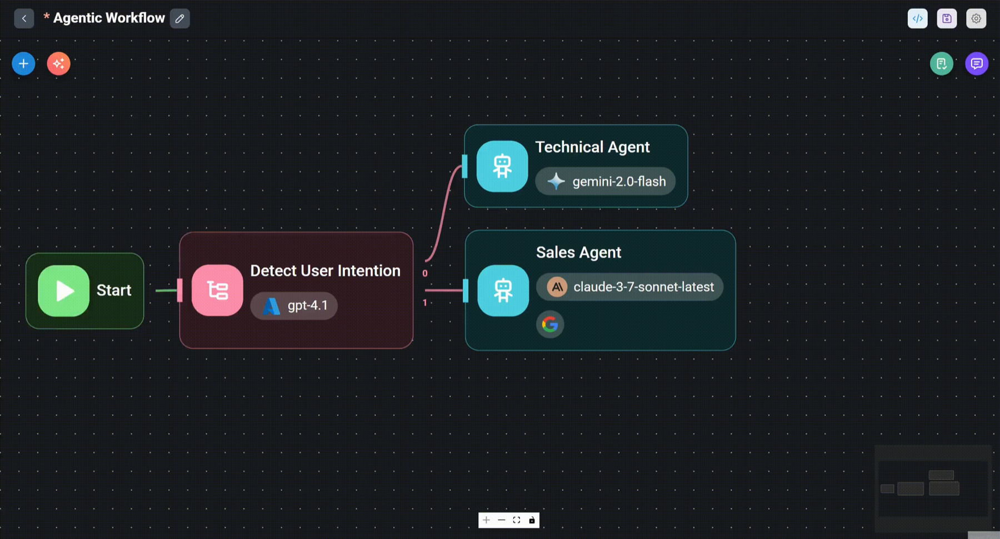

- **SurfSense** (16.266 Sterne): war NotebookLM-artig mit YouTube-Connector, ist jetzt eine air-gapped Desktop-App für lokale Dokumente. Kein Canvas.
- **Flowise, Langflow**: Canvas für Agenten-Pipelines, die man baut und dann ausführt. Poppy ist ein Denk-Board, kein Pipeline-Builder.
- **basketikun/infinite-canvas** (7.066, MIT), **Toonflow** (16.056, MIT), **TwitCanva** (282, Apache 2.0), **flowboard** (449, keine Lizenz): KI-Canvas für Bild- und Videogenerierung, nicht für Recherche.
- **langchain-ai/open-canvas**: archiviert, Dokument-Editor, kein Whiteboard.
- **Excalidraw** (132.997, MIT): Zeichen-Whiteboard, Custom-Nodes mit Logik sind mühsam.
- **penecho** (2.410, AGPL): Handschrift- und Mathe-Canvas.
- **aron166/canvasflow**: nennt sich "Open-source alternative to Poppy AI", 0 Sterne, keine Lizenz, ein Tag Commits (14.08.2026). Interessant nur wegen der Idee, den Claude-Abo-Zugang über die `claude`-CLI als Backend zu nutzen.
- Schon vorher als schwach eingestuft und hier nicht erneut bewertet: coderkai03/poppy-clone, prajwal-tomar/poppy-clone, Graphlink, curiso, rabbitmap.

## Bausteine

| Aufgabe | Empfehlung | Lizenz | Sterne | Anmerkung |
|---|---|---|---|---|
| Canvas | React Flow (@xyflow/react) | MIT | 38.501 | Standard, Refly und ThoughtDAG nutzen es |
| Canvas mit Whiteboard-Gefühl | tldraw | tldraw-Lizenz | 50.583 | Hobby-Lizenz mit Wasserzeichen |
| Video-Download YouTube, TikTok, Instagram | yt-dlp | Unlicense | 193.740 | Instagram braucht oft Browser-Cookies |
| YouTube-Untertitel ohne Download | youtube-transcript-api | MIT | 8.377 | schnell, kann an IP-Sperren scheitern, dann yt-dlp plus Whisper |
| Transkription lokal auf dem Mac | whisper.cpp | MIT | 53.942 | Metal-Beschleunigung |
| Transkription lokal, Apple Silicon | mlx-audio / parakeet-mlx | MIT / Apache 2.0 | 7.949 / 983 | sehr schnell auf M-Chips |
| Webseite zu Markdown | defuddle | MIT | 9.519 | hast du schon als Skill |
| Webseite zu Markdown (Alternativen) | Mozilla Readability, trafilatura, Jina Reader | Apache 2.0 | 11.465 / 6.868 / 12.046 | |
| PDF anzeigen | pdf.js | Apache 2.0 | 53.954 | |
| PDF zu Text | docling, markitdown | MIT | 67.991 / 187.149 | marker: Code Apache 2.0, Modellgewichte nur frei bis 5 Mio. USD Umsatz |
| Alles-in-einem-Extraktion | content-core | MIT | 174 | YouTube, Web, PDF, Audio, Video, dazu CLI und MCP |
| Multi-Model-Chat | Vercel AI SDK | Apache 2.0 | 26.967 | @ai-sdk/anthropic, /openai, /google |
| Ein Key für alle Modelle | OpenRouter | Dienst | | über OpenAI-kompatiblen Endpoint |
| Board-Speicherformat | JSON Canvas | MIT | 3.705 | Boards bleiben Obsidian-kompatibel |

## Build-Strategie

### Option A: ThoughtDAG forken und um Quellen-Nodes erweitern

Vorgehen: Fork, dann Node-Typen "YouTube/TikTok/Instagram-Link", "Webseite", "Voice Note" ergänzen. Ein kleiner lokaler Dienst (yt-dlp plus whisper.cpp plus defuddle) liefert Transkripte, die als Kontext in die vorhandene Wire-Logik fließen. Dazu ein Board-Dashboard.

- Aufwand: gering bis mittel. Kontext-Logik, Multi-Model, PDF, Sharing und Desktop-Build sind fertig. Geschätzt 1 bis 2 Wochen Abendarbeit mit Claude Code bis zu einem brauchbaren Stand.
- Nähe zu Poppy: rund 75 Prozent. Das Grundgefühl bleibt "verzweigendes Gespräch", nicht "Quellen-Board".
- Lizenzrisiko: keins (MIT).
- Haken: fremde, schnell wachsende Codebasis mit Features, die du nicht brauchst (Jev, Harness-Plugin, Session-Recall). Upstream-Updates einzupflegen wird nach wenigen Wochen mühsam. Bus-Faktor 1.

### Option B: eigene App auf React Flow plus Bausteine (Empfehlung)

Vorgehen: Vite oder Next.js, React Flow, Vercel AI SDK. Node-Typen genau nach Poppy (Video, PDF, Web, Bild, Voice, Text, Gruppe, Chat). Kontext-Sammlung beim Chat: alle eingehenden Kanten ablaufen, Transkripte und Texte einsammeln, an das gewählte Modell schicken. Das Muster ist in ThoughtDAG und im tldraw-Branching-Chat-Kit fertig vorgebaut und darf gelesen werden, ThoughtDAG-Code darf dank MIT auch übernommen werden. Ingestion als lokaler Python- oder Node-Dienst mit yt-dlp, whisper.cpp oder parakeet-mlx, defuddle, docling (oder gleich content-core). Speicherung als SQLite oder JSON-Canvas-Dateien im YT-OS-Repo.

- Aufwand: mittel. MVP (Canvas, drei Quellentypen, Chat-Node, Boards) etwa 2 bis 3 Wochen. Poppy-Parität inklusive Gruppen, Voice Notes, Bildern und Sharing eher 4 bis 8 Wochen.
- Nähe zu Poppy: bis 90 Prozent erreichbar, weil jede UX-Entscheidung deine ist.
- Lizenzrisiko: keins. Alle Bausteine MIT, Apache oder Unlicense. Später an andere zu verkaufen ist offen.
- Vorteil für YT-OS: Die App kann direkt in deine Pipeline schreiben (Skript-Board, Outlier-Recherche, Transkripte als Dateien im Repo), statt eine Insel zu sein.
- Haken: Du baust die Grundfunktionen (Undo, Auto-Layout, Persistenz, Copy-Paste) selbst. React Flow deckt davon nur einen Teil ab.

### Option C: Obsidian Canvas plus Claude Code

Vorgehen: Ein Board ist eine `.canvas`-Datei im Vault. Ein Claude-Code-Skill nimmt Links, transkribiert (bestehende `/watch`- und `defuddle`-Skills), legt Markdown-Karten auf den Canvas. Ein zweiter Skill "frag das Board" liest die Kanten zu einer Chat-Karte, sammelt den Kontext und schreibt die Antwort als neue Karte daneben. Optional Canvas LLM für Chats direkt im Canvas.

- Aufwand: gering, etwa 1 bis 3 Tage.
- Nähe zu Poppy: rund 50 Prozent. Kein Live-Chat im Node, kein Drag-and-drop mit automatischer Transkription, Wechsel zwischen Obsidian und Terminal.
- Lizenzrisiko: keins, für andere Nutzer aber kaum übertragbar.
- Vorteil: läuft über dein Claude-Abo statt über API-Kosten, sofort nutzbar, Daten liegen als Markdown im Vault.

### Vergleich

| | A: ThoughtDAG-Fork | B: eigene App | C: Obsidian plus Claude Code |
|---|---|---|---|
| Aufwand bis nutzbar | 1 bis 2 Wochen | 2 bis 3 Wochen | 1 bis 3 Tage |
| Nähe zu Poppy | etwa 75 % | bis 90 % | etwa 50 % |
| Lizenzrisiko | keins | keins | keins |
| Später für andere | möglich, fremde Architektur | gut | schlecht |
| Wartungslast | hoch (Upstream-Drift) | mittel | gering |

### Empfehlung

Kurzfristig C als Überbrückung, weil es in Tagen läuft und die YT-OS-Skills wiederverwendet. Parallel B als eigentliches Produkt, mit ThoughtDAG als Code-Steinbruch für Kontext-Sammlung, Kontext-Vorschau, PDF-Clipping und Provider-Anbindung. Refly v0.10.0 nur als UX-Referenz lokal testen, keinen Code übernehmen (Lizenz und Patent-Hinweis). tldraw nur dann statt React Flow, wenn das Freihand-Whiteboard-Gefühl wichtig ist und das Tool dauerhaft privat bleibt.

Offene Frage für die Entscheidung: Wie wichtig ist "später für andere"? Wenn es nie dazu kommt, ist A schneller als B. Sobald ein Angebot an Dritte realistisch ist, gewinnt B.

## Screenshots in diesem Ordner

| Datei | Inhalt |
|---|---|
| refly-01.png | Refly Canvas-Ära: Weblink-Nodes, KI-Antwort, Dokument-Editor |
| refly-02.png | Refly: großes Board mit vielen Nodes (React Flow) |
| refly-03.png | Refly heute: "Vibe Workflow Platform" (nach dem Pivot) |
| thoughtdag-01.png | ThoughtDAG: verzweigte Frage-Nodes auf dem Canvas |
| thoughtdag-02.png | ThoughtDAG: Thumbnail der 33-Sekunden-Tour |
| tldraw-01.png | tldraw SDK Hero |
| tldraw-02.png | tldraw Branching-Chat-Kit mit "made with tldraw"-Wasserzeichen |
| reactflow-01.png | React Flow AI Workflow Editor (Pro-Template) |
| open-notebook-01.png | open-notebook: Quellen, Notizen, Chat |
| affine-01.png | AFFiNE Hero |
| affine-02.png | AFFiNE Whiteboard-Landingpage |
| obsidian-cannoli-01.png | Cannoli: LLM-Skript im Obsidian Canvas |
| obsidian-canvas-llm-01.png | Canvas LLM: Input- und Generate-Karten |
| nodetool-01.png | NodeTool Workflow-Editor |
| opencove-01.png | OpenCove: Claude-Code-Sessions auf dem Canvas |
| surfsense-01.png | SurfSense Desktop (off-target) |
| flowise-01.png | Flowise Agentflow (off-target) |

## Quellen

- Refly Releases und Lizenz: https://github.com/refly-ai/refly/releases, https://github.com/refly-ai/refly/blob/main/LICENSE
- Refly Docker-Images: https://hub.docker.com/r/reflyai/refly-api/tags
- ThoughtDAG: https://github.com/chenxiachan/thoughtdag
- tldraw Lizenz, Hobby-Lizenz, Starter Kits: https://github.com/tldraw/tldraw/blob/main/LICENSE.md, https://tldraw.dev/get-a-license/hobby, https://tldraw.dev/starter-kits/branching-chat
- React Flow AI Workflow Editor: https://reactflow.dev/ui/templates/ai-workflow-editor
- AFFiNE Lizenz und Self-Host-AI: https://github.com/toeverything/AFFiNE/blob/canary/LICENSE, https://docs.affine.pro/self-host-affine/administer/ai, https://github.com/toeverything/AFFiNE/discussions/11722
- open-notebook, content-core: https://github.com/lfnovo/open-notebook, https://github.com/lfnovo/content-core
- Poppy-Alternativen (kommerziell, zur Einordnung): https://www.chatgrid.ai/blog/best-poppy-ai-alternatives, https://get.nodeflowai.com/comparison/poppy-ai
