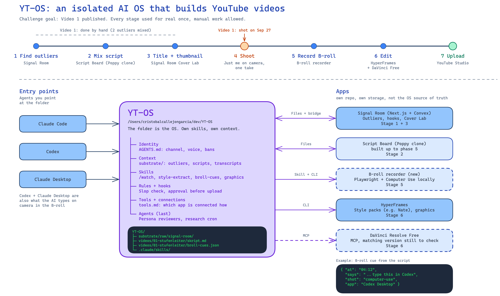

# YT-OS

Mein KI-Betriebssystem für YouTube-Produktion. Es verbindet Claude Code, Codex und eigene Apps zu einer Pipeline, die vom Outlier-Video bis zum Upload reicht.

Das Ziel der 30-Tage-Challenge (EA-Community, Start 2026-09-25): **Video 1 ist auf YouTube veröffentlicht**, und jede Stufe der Pipeline wurde dafür einmal echt benutzt. Handarbeit ist erlaubt, wo eine Stufe noch hakt. Das Video wartet nie auf eine perfekte Stufe.

Bearbeitbare Fassung: [docs/yt-os-architecture-community.excalidraw](docs/yt-os-architecture-community.excalidraw)

## Wie es aufgebaut ist

Der Ordner ist das OS. Er hat sechs Schichten: Identität, Kontext, Skills, Regeln, Agents und Tools. Die Agenten (Claude Code, Codex, Claude Desktop, Codex Desktop) werden auf diesen Ordner gerichtet. Apps mit eigenem Repo hängen außen dran und werden über Dateien, CLI oder MCP angebunden. Andere OS bleiben getrennt, es gibt keine geteilten Skills.

## Das OS

| Layer | Datei | Stand |
|---|---|---|
| Identität | [identity.md](identity.md) | steht |
| Kontext | [substrate/](substrate/) | Gerüst, Playbooks folgen |
| Regeln und Hooks | [rules/](rules/), `.githooks/`, `.claude/hooks/` | steht |
| Skills | [substrate/skills.md](substrate/skills.md), `.claude/skills/` | Skript-Kette gebaut |
| Agents | | bewusst zuletzt |
| Tools | [tools.md](tools.md) | steht |

## Regeln und Schutz

Das Repo ist öffentlich. Zwei Dateien legen die Grenzen fest: [rules/never.md](rules/never.md) und [rules/always.md](rules/always.md). Die wichtigsten Regeln erzwingen Hooks: Ein Git-Guard blockiert Transkripte, Videos und Zugangsdaten vor jedem Commit und Push. Ein Slop-Gate blockiert KI-Sprech in Skripten, und ein Publish-Gate fragt nach, bevor etwas veröffentlicht wird. Nach dem Klonen einmal ausführen: `git config core.hooksPath .githooks`

## Die sieben Stufen

| Stufe | Werkzeug | Stand |
|---|---|---|
| 1 Outlier finden | Signal Room (YouTube-Datenquelle fehlt noch) | für Video 1 von Hand |
| 2 Skript mixen | Skript-Board im Poppy-Stil | für Video 1 von Hand, [Skript](videos/01-stufenleiter/skript.md). Board gebaut bis Phase 5 (27.09.), nutzbar ab Video 2, [Repo](https://github.com/christophercallejongarcia/signal-room-skript-board) |
| 3 Titel und Thumbnail | Signal Room Cover Lab | offen |
| 4 Dreh | DJI Osmo Pocket 4, Elgato Teleprompter | gedreht 2026-09-27, [Dreh-Log](videos/01-stufenleiter/dreh-log.md) |
| 5 B-Roll aufnehmen | B-Roll-Recorder: Playwright und Computer Use | offen |
| 6 Schnitt | HyperFrames und DaVinci Resolve Free über MCP | offen |
| 7 Upload | YouTube Studio | offen |

## Video 1

"Vom Fragensteller zum Chef: Die 6 Stufen, Claude zu nutzen"

- [Briefing](videos/01-stufenleiter/brief.md): Zielgruppe, Kernaussage, Laufzeit, was bewusst fehlt
- [Skript](videos/01-stufenleiter/skript.md): Sprechfassung, gemischt aus zwei Outlier-Videos

## Planung und Recherche

Die Planung läuft als Wayfinder-Map mit Entscheidungs-Tickets unter `.scratch/yt-os/`. Recherchen bisher:

- [Kallaway: YouTube for Business Owners Blueprint](.scratch/yt-os/assets/kallaway-blueprint-vsl.md): Referenzmodell für die Stufen
- [Brad Bonanno: automatische B-Roll](.scratch/yt-os/assets/brad-bonanno-auto-broll.md): Vorbild für den B-Roll-Recorder

## Log

| Datum | Was |
|---|---|
| 2026-10-01 | Tag 7: Descript läuft wieder. Ursache: Die 5,3-GB-DJI-Datei (10-Bit-HEVC plus 2,3 GB Kameradaten) wurde nie fertig hochgeladen, der Export fand die Quelle nicht. Lösung: vor dem Import nach H.264 mit nur Bild und Ton umwandeln, dann Upload in 5 Minuten und vollständiger Export. Descript-MCP in Claude Code verbunden, Agent Underlord schneidet nach Marks Cleanup-Prompt: 10:06 statt 23:38, 99,1 % gleicher Wortlaut wie der lokale Schnitt (10:29), rund 50 AI-Credits ([Ticket 20](.scratch/yt-os/issues/20-schnitt-test.md)). Ton der Schnittfassung mit Cleanvoice bereinigt, erste Fassung klang künstlich, mildere Fassung nur mit Rauschentfernung liegt zum Anhören bereit, 0 € ([Ticket 24](.scratch/yt-os/issues/24-ton-und-untertitel.md)). Thumbnails: Versuchsreihe mit 12 Entwürfen, 4 davon ohne Gesicht nach Marks Rat, Schrift per Code, Prompt als JSON nach Jays Tipp. JSON allein brachte keinen klaren Unterschied, Stil-JSON aus zerlegten Vorlagen war bei 3 von 4 Entwürfen deutlich hochwertiger ([Ticket 09](.scratch/yt-os/issues/09-thumbnail-cover-lab.md), [Packaging](videos/01-stufenleiter/packaging.md)) |
| 2026-09-28 | Signal Room kann jetzt YouTube (Stufe 1): YouTube Data API v3, Suche über 10 Begriffe in 4 Themen, Outlier nach Kanal-Median der letzten 30 Longform-Videos ([Ticket 11](.scratch/yt-os/issues/11-signal-room-youtube-umfang.md)). Erster Lauf: 150 Kanäle gemessen, 68 Outlier ab 3x, 63 Kandidaten, 13 % der Tagesquota. Regler YouTube/Instagram in allen Reitern. Titel-Builder liefert 5 [Titel-Varianten für Video 1](videos/01-stufenleiter/titel-varianten.md), jede mit Verweis auf die Outlier, die sie angeregt haben. Thumbnail-Builder mit echten Standbildern aus dem Dreh in Arbeit. Gebaut mit einem Agenten-Team in T3 (Captain verteilt, Cooks bauen, Cleaner reviewt jeden PR), 3 PRs gemergt. Dazu englische Architektur- und B-Roll-Grafiken und ein erster Skript-Entwurf für Video 2 aus Poppy |
| 2026-09-27 | Video 1 gedreht: Haupt-Take 23:38 min in 4K auf der DJI Osmo Pocket 4, dazu 6 kurze Test-Clips. Rohmaterial bleibt lokal, im Repo liegen [Dreh-Log](videos/01-stufenleiter/dreh-log.md) mit Metadaten, SHA-256 und Nachweisbild. Pipeline-Stufe 4 damit einmal echt benutzt |
| 2026-09-27 | Skript-Board (Stufe 2) gebaut, Phase 0a bis 5 in 9 Commits: Board-Liste, Canvas, YouTube-Node mit Transkript per yt-dlp, Chat-Node mit Claude Code, Codex und Command Code in einer Sandbox. 548 Unit-, 50 Convex- und 26 E2E-Tests grün. Öffentliche Kopie: [signal-room-skript-board](https://github.com/christophercallejongarcia/signal-room-skript-board) |
| 2026-09-26 | Alle 6 OS-Layer einmal durchlaufen: Identität, Kontext-Gerüst, Regeln mit 4 Hooks (Git-Guard, Slop-Gate, Publish-Gate, Ticket-Ship), Skript-Kette als 4 Skills, Agents bewusst zurückgestellt, Tools-Liste. Wayfinder-Map mit 19 Tickets, 6 entschieden. Poppy-Nachbau recherchiert und MVP geplant |
| 2026-09-26 | Repo angelegt, Architektur gezeichnet, Referenzen recherchiert, Skript und Briefing für Video 1 abgelegt |
