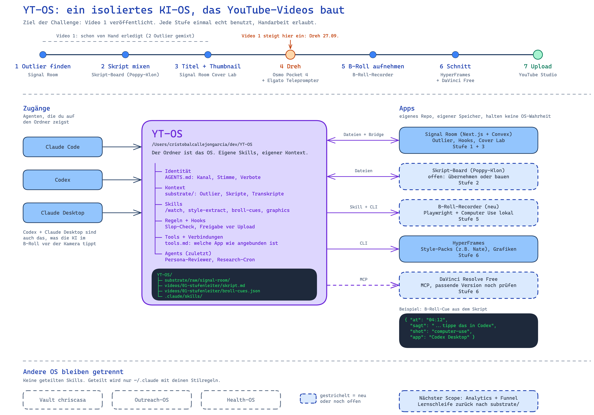

# YT-OS

Mein KI-Betriebssystem für YouTube-Produktion. Es verbindet Claude Code, Codex und eigene Apps zu einer Pipeline, die vom Outlier-Video bis zum Upload reicht.

Das Ziel der 30-Tage-Challenge (EA-Community, Start 2026-09-25): **Video 1 ist auf YouTube veröffentlicht**, und jede Stufe der Pipeline wurde dafür einmal echt benutzt. Handarbeit ist erlaubt, wo eine Stufe noch hakt. Das Video wartet nie auf eine perfekte Stufe.

Bearbeitbare Fassung: [docs/yt-os-architektur.excalidraw](docs/yt-os-architektur.excalidraw)

## Wie es aufgebaut ist

Der Ordner ist das OS. Er hat sechs Schichten: Identität, Kontext, Skills, Regeln, Agents und Tools. Die Agenten (Claude Code, Codex, Claude Desktop) werden auf diesen Ordner gerichtet. Apps mit eigenem Repo hängen außen dran und werden über Dateien, CLI oder MCP angebunden. Andere OS bleiben getrennt, es gibt keine geteilten Skills.

## Die sieben Stufen

| Stufe | Werkzeug | Stand |
|---|---|---|
| 1 Outlier finden | Signal Room (YouTube-Datenquelle fehlt noch) | für Video 1 von Hand |
| 2 Skript mixen | Skript-Board im Poppy-Stil | für Video 1 von Hand, [Skript](videos/01-stufenleiter/skript.md) |
| 3 Titel und Thumbnail | Signal Room Cover Lab | offen |
| 4 Dreh | DJI Osmo Pocket 4, Elgato Teleprompter | geplant 2026-09-27 |
| 5 B-Roll aufnehmen | B-Roll-Recorder: Playwright und Computer Use | offen |
| 6 Schnitt | HyperFrames und DaVinci Resolve Free über MCP | offen |
| 7 Upload | YouTube Studio | offen |

## Video 1

"Vom Fragensteller zum Chef: Die 6 Stufen, Claude zu nutzen"

- [Briefing](videos/01-stufenleiter/brief.md): Zielgruppe, Kernaussage, Laufzeit, was bewusst fehlt
- [Skript](videos/01-stufenleiter/skript.md): Sprechfassung, gemischt aus zwei Outlier-Videos

## Planung und Recherche

Die Planung läuft als Wayfinder-Map mit Entscheidungs-Tickets unter `.scratch/yt-os/`. Recherchen bisher:

- [Kallaway: YouTube for Business Owners Blueprint](.scratch/yt-os/assets/kallaway-blueprint-vsl.md): Referenzmodell für die Stufen
- [Brad Bonanno: automatische B-Roll](.scratch/yt-os/assets/brad-bonanno-auto-broll.md): Vorbild für den B-Roll-Recorder

## Log

| Datum | Was |
|---|---|
| 2026-09-26 | Repo angelegt, Architektur gezeichnet, Referenzen recherchiert, Skript und Briefing für Video 1 abgelegt |
