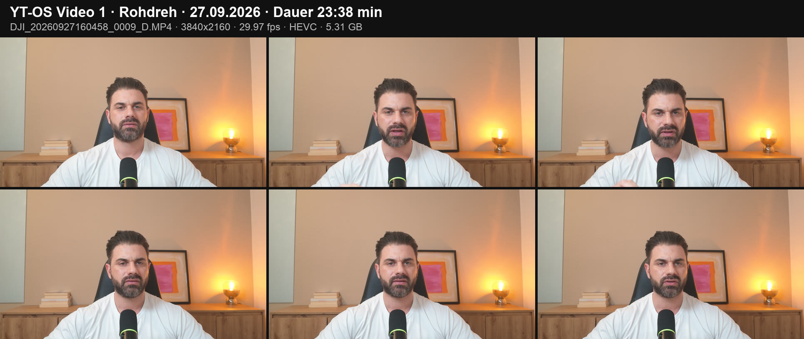

# Dreh-Log Video 1

Gedreht am 27.09.2026 mit der DJI Osmo Pocket 4. Das Rohmaterial bleibt lokal, bis der Schnitt steht. Im Repo liegen nur dieses Log und das Nachweisbild.

## Haupt-Take

| Feld | Wert |
|---|---|
| Datei | `DJI_20260927160458_0009_D.MP4` |
| Start | 27.09.2026, 16:04 Uhr |
| Dauer | 23:38 min (1418 s) |
| Format | 3840x2160, 29,97 fps, HEVC |
| Größe | 5,31 GB |
| SHA-256 | `38e75ade6dab1531d1f93eeddd9c38d9b03030e2eecb286ce0e30dc2380625c3` |

Der SHA-256-Wert ist der Fingerabdruck der Rohdatei. Wer die Datei später bekommt, kann mit `shasum -a 256` prüfen, dass es genau diese Aufnahme ist.

## Weitere Clips vom selben Tag

Test- und Einzelaufnahmen, zusammen etwa 2 Minuten.

| Datei | Dauer |
|---|---|
| `DJI_20260927155055_0004_D.MP4` | 0:04 |
| `DJI_20260927155218_0005_D.MP4` | 1:22 |
| `DJI_20260927155553_0006_D.MP4` | 0:11 |
| `DJI_20260927155654_0007_D.MP4` | 0:10 |
| `DJI_20260927155807_0008_D.MP4` | 0:10 |
| `DJI_20260927164437_0010_D.MP4` | 0:01 |

## Transkript

Am 29.09.2026 mit ElevenLabs Scribe erstellt, mit Zeitstempel pro Wort. Es liegt lokal in `private/video-01/` und nicht im Repo.

## Nächster Schritt

Schnitt in DaVinci Resolve Free, danach Thumbnail.
